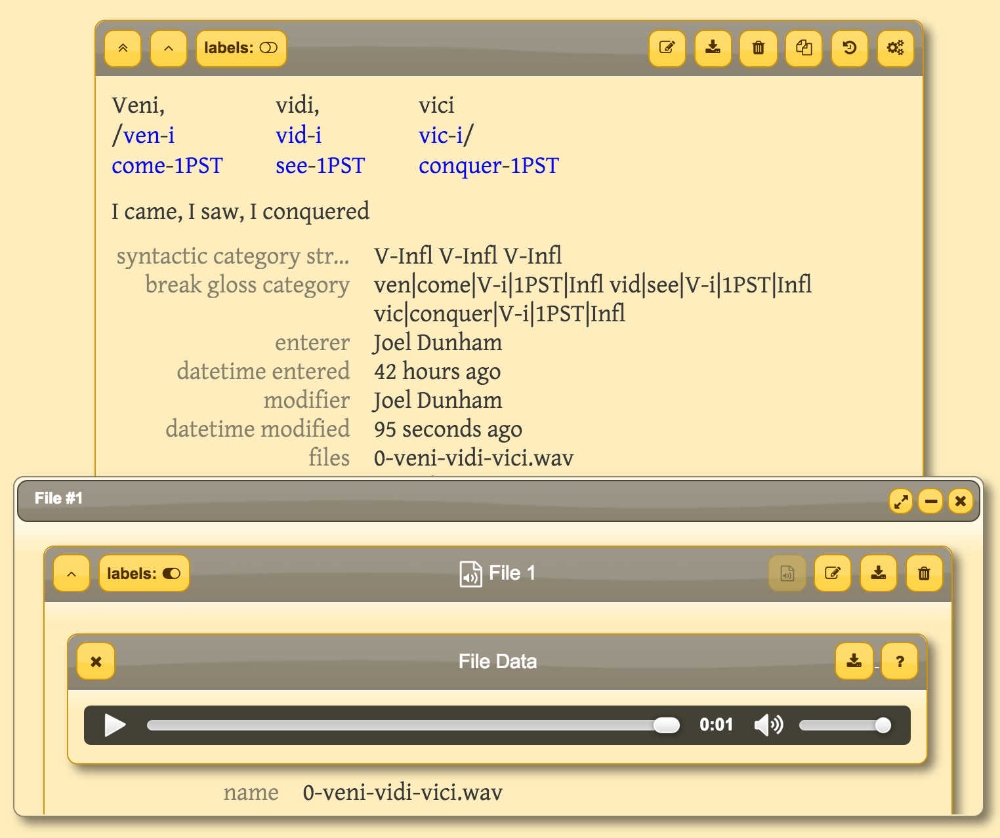

# Dative: a GUI for FieldDB and the OLD

## Description

Dative is a browser-based application for linguistic fieldwork and language
documentation.

Its high-level goals are:

- to interface with multiple server-side backends (FieldDB corpora, OLDs)
- to incorporate the best parts of existing linguistic fieldwork database
  application GUIs:

  - [Spreadsheet](http://app.lingsync.org/)
  - [Prototype](https://chrome.google.com/webstore/detail/placeholder/eeipnabdeimobhlkfaiohienhibfcfpa)
  - [OLD](http://www.onlinelinguisticdatabase.org)
  - [FLEx](http://fieldworks.sil.org/flex/)
  - [EOPAS](http://www.eopas.org/)

## For Developers

Dative is open source, just beginning, and under active development.

### Technologies

- Backbone
- CoffeeScript
- Mocha/Chai tests
- Grunt task automation

### Install

First, make sure you have NodeJS >= 0.10 installed. Then install the Grunt
command line interface (CLI):

    $ sudo npm install -g grunt-cli

Then clone the dative repo and move into the clone:

    $ git clone https://github.com/jrwdunham/dative.git
    $ cd dative

Then install the Node dependencies:

    $ npm install

Then install the Bower dependencies for the app and the tests:

    $ bower install
    $ cd test
    $ bower install
    $ cd ..

### Serve, test, build, etc.

To serve the app with livereload, run:

    $ grunt serve

The serve task generates source map files that Chrome's developer tools can
recognize. This means that you can view the CoffeeScript source in the browser
and can set breakpoints, etc. For some docs on CoffeeScript source maps and
JavaScript debugging in Chrome, see:

- http://www.html5rocks.com/en/tutorials/developertools/sourcemaps/
- https://developer.chrome.com/devtools/docs/javascript-debugging

To run the tests and view the Mocha print-out in the browser, run:

    $ grunt serve:test

After running the above command, the browser will automatically refresh
whenever a source file or a test file is saved. This allows you to code with
constant updates showing which tests are passing.

To build the app in the dist/ directory:

    $ grunt build

To build the app in the dist/ directory and serve the result:

    $ grunt serve:dist

To validate the CoffeeScript using coffeelint:

    $ grunt lint

To run the tests and view the results in the command line (*currently
not working*):

    $ grunt test

To generate the docco HTML docs using the comments in your source files:

    $ grunt docs

The above command generates files in the docs/ directory. Because docco
overwrites files of the same name in different directories, I have configured
the Gruntfile to rename each file for doc generation using the file's path.

#### Compass/Sass Complications

Long story short: we are not currently using Compass/Sass/SCSS.

The default grunt file from the Backbone Yo generator uses the
grunt-contrib-compass Grunt plugin to convert SCSS/Sass files to CSS. This
requires that Ruby, Sass, and Compass >=0.12.2 be installed. If you're on OS X
or Linux you probably already have Ruby installed; test with ruby -v in your
terminal.

I have been unable to successfully install Compass on Debian. Following
http://www.rosehosting.com/blog/install-ruby-sass-and-compass/, I did the
following:

    $ sudo apt-get install rubygems
    $ sudo gem install compass

I can find compass in /var/lib/gems/1.8/gems/compass-0.12.7/bin/compass; however,
the Grunt tasks are unable to locate it (despite how I alter my $PATH).

On other Unix systems (with Ruby installed), successfully installing Compass
and Sass may be as easy as running:

    $ sudo gem update --system && gem install compass

I had no trouble installing Compass/Sass on my Mac OS X system and running the
default Yo Backbone generator's Gruntfile. However, since Debian is not
cooperating with Ruby/Compass, I have (at present) commented out the calls to
the compass Grunt task in the Gruntfile. If we decide that using SCSS is
important at a later time, it may be necessary to delve into this
Debian/Compass issue further.

### Coding Conventions

The [CoffeeScript styleguide](https://github.com/polarmobile/coffeescript-style-guide)
should be followed. Adherence to the second principle of *The Zen of Python* is
advised: "Explicit is better than implicit."

A baseline test for decent CoffeeScript is to run `grunt lint` and ensure that
there are no errors. For now I have configured grunt-coffeelint to allow
implicit parentheses but issue warnings. It may be a good idea to change these
warnings to errors if the code becomes unreadable.

For articles on how CoffeeScript can encourage the creation of unreadable
code, see:

- http://ceronman.com/2012/09/17/coffeescript-less-typing-bad-readability/
- http://ryanflorence.com/2011/case-against-coffeescript/

